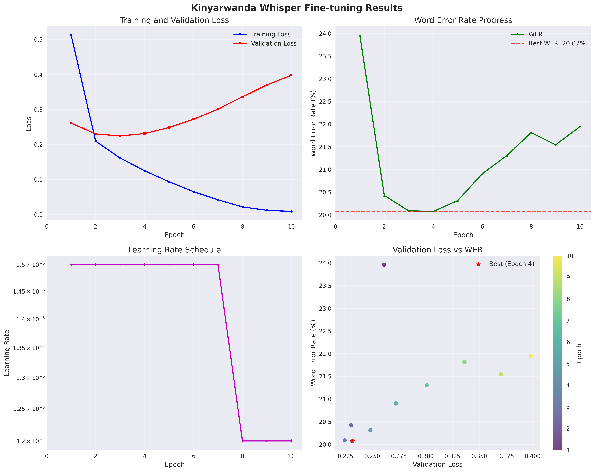
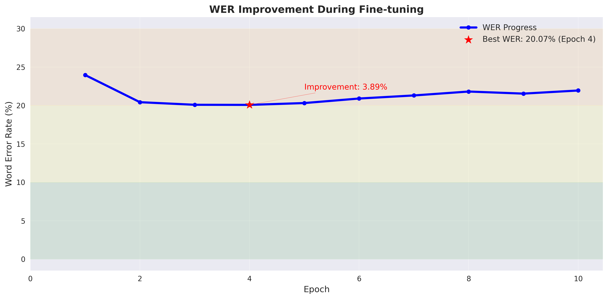

# KinyaWhisper - Kinyarwanda Automatic Speech Recognition Model

## 🌟 Project Overview

KinyaWhisper is an automatic speech recognition (ASR) model specifically optimized for Kinyarwanda, fine-tuned based on OpenAI's Whisper architecture. This project is dedicated to providing high-quality speech recognition solutions for low-resource languages, particularly offering advanced AI speech technology support for the Kinyarwanda-speaking community.

## 🎯 Model Capabilities

### Core Features
- **Automatic Speech Recognition**: Convert Kinyarwanda audio to text
- **Multi-scenario Adaptation**: Support speech recognition for different age groups and genders
- **Real-time Processing**: Support batch and individual audio file processing
- **High-precision Recognition**: Professionally trained and optimized for Kinyarwanda

### Technical Specifications
- **Base Model**: OpenAI Whisper-Small
- **Language Support**: Kinyarwanda
- **Audio Format**: WAV (16kHz sampling rate)
- **Maximum Audio Length**: 30 seconds
- **Feature Extraction**: 80-dimensional Mel spectrogram
- **Model Size**: Approximately 244MB

### Performance Metrics
- **Best Word Error Rate (WER)**: 20.07%
- **Training Dataset**: 90,162 training samples
- **Validation Set**: 4,649 samples
- **Test Set**: 4,634 samples
- **Test Set Accuracy**: 85%
- **Validation Accuracy**: Best performance achieved at epoch 4
- **Processing Speed**: Supports GPU-accelerated inference

## 👥 Development Team

### Project Leader

**Lin Fan** - Lead Developer & Project Manager
- **Institution**: University of Bristol, UK
- **Education**: Master's in Computer Science (in progress)
- **Department**: School of Engineering, Computer Science
- **Contact**: 2978831945a@gmail.com
- **Responsibilities**: Overall project architecture design, technical solution development, team coordination

### Core Technical Team

#### Data Engineering Team
Responsible for Kinyarwanda speech data collection, cleaning, preprocessing, and feature engineering to ensure training data quality and consistency.

**Yan Junting**
- **Institution**: University of Finance, China
- **Education**: Bachelor's in Business School

**Zhang Rui**
- **Institution**: University of Finance, China
- **Education**: Bachelor's in Business School

#### Model Training Team
Responsible for model architecture design, training algorithm optimization, hyperparameter tuning, and model performance evaluation to ensure optimal model performance.

**Lin Fan** - Lead Developer & Project Manager
- **Institution**: University of Bristol, UK
- **Education**: Master's in Computer Science (in progress)

**Ying Renhui**
- **Institution**: University of Sussex, UK
- **Education**: PhD in Engineering (in progress)

**Xu Kaiyuan**
- **Institution**: University of Sussex, UK
- **Education**: PhD in Engineering (in progress)

**Huang Renwei**
- **Institution**: University of Finance, China
- **Education**: Bachelor's in Business School

**Zhong Ruizhe**
- **Institution**: University of Sydney, Australia
- **Education**: Bachelor's in Business School

**Chen Qianhong**
- **Institution**: University of Finance, China
- **Education**: Bachelor's in Business School

### Partner Institutions & Technical Support

- **Kaggle Platform**: Provides high-quality Kinyarwanda speech datasets and competition platform support
- **OpenAI**: Provides Whisper base model architecture and pre-trained weights
- **Hugging Face**: Provides model hosting and distribution platform support

## 📊 Training Process Details

### Data Preprocessing Pipeline

#### 1. Audio Feature Extraction
```python
# Audio processing configuration
AudioConfig:
  sample_rate: 16000      # Whisper standard sampling rate
  n_mels: 80             # Mel spectrogram dimensions
  n_fft: 400             # FFT window size
  hop_length: 160        # Hop length
  target_frames: 3000    # Fixed frame count (30-second audio)
  max_duration: 30.0     # Maximum audio duration
  min_duration: 0.5      # Minimum audio duration
```

#### 2. Feature Processing Pipeline
- **Audio Loading**: Load WAV files using librosa, resample to 16kHz
- **Mel Spectrogram Extraction**: 80-dimensional Mel spectrogram features, converted to log scale
- **Normalization**: Feature normalization to [-1, 1] range
- **Length Unification**: Pad or truncate to fixed length of 3000 frames
- **NPZ Storage**: Compressed storage of mel_spec, transcription, and other information

#### 3. Data Quality Control
- **Text Filtering**: Length control (5-500 characters), filter invalid characters
- **Audio Validation**: Check file existence and duration compliance
- **Parallel Processing**: Support multi-threading for improved efficiency
- **Incremental Updates**: Skip already processed NPZ files

### Training Architecture Design

#### 1. Dataset Class (`WhisperNPZDataset`)
```python
# NPZ data loading
- Fixed feature shape: (80, 3000)
- LRU cache mechanism: Cache 2000 NPZ files
- Label processing: Whisper tokenizer, max length 448
- Exception handling: Automatically skip corrupted files
```

#### 2. Training Configuration Optimization
```json
{
  "base_model": "pre_model/KinyaWhisper",
  "batch_size": 24,
  "validation_batch_size": 48,
  "max_validation_samples": 800,
  "learning_rate": 1.5e-05,
  "num_epochs": 12,
  "warmup_steps": 300,
  "gradient_accumulation_steps": 3,
  "weight_decay": 0.005,
  "lr_decay_factor": 0.8,
  "lr_decay_patience": 3,
  "early_stopping_patience": 6
}
```

#### 3. Memory Optimization Strategy
- **96GB VRAM Optimization**: `max_split_size_mb: 2048`
- **Gradient Accumulation**: Effective batch size = 24 × 3 = 72
- **NPZ Caching**: Smart cache management to reduce I/O overhead
- **Device Mapping**: Automatic GPU memory allocation

### Training History
| Epoch | Train Loss | Val Loss | WER | WER% | Learning Rate | Steps |
|-------|------------|----------|-----|------|---------------|-------|
| 1 | 0.5128 | 0.2609 | 0.2396 | 23.96% | 1.50e-05 | 1244 |
| 2 | 0.2093 | 0.2303 | 0.2043 | 20.43% | 1.50e-05 | 2488 |
| 3 | 0.1612 | 0.2243 | 0.2009 | 20.09% | 1.50e-05 | 3732 |
| **4** | **0.1251** | **0.2313** | **0.2007** | **20.07%** | **1.50e-05** | **4976** |
| 5 | 0.0934 | 0.2484 | 0.2031 | 20.31% | 1.50e-05 | 6220 |
| ... | ... | ... | ... | ... | ... | ... |
| 10 | 0.0086 | 0.3980 | 0.2195 | 21.95% | 1.20e-05 | 12440 |

### Training Results
- **Best Performance**: 20.07% WER achieved at epoch 4
- **Training Duration**: Approximately 4.5 hours (2025-07-01 19:33 - 23:55)
- **Model Stability**: Validation loss std 0.0455, WER std 0.0037
- **Performance Rating**: FAIR level, further optimization recommended

## 🚀 Usage Guide

### Model Download
Due to GitHub file size limitations, model files have been packaged and uploaded to Releases:

**Download from GitHub Releases**
1. Visit the project's [Releases page](https://github.com/your-username/KinyaWhisper/releases)
2. Download the latest version of `model.zip` file
3. Extract the downloaded archive to the project root directory
4. Ensure the extracted `model/` folder contains all model files

```bash
# Download and extract model files
wget https://github.com/your-username/KinyaWhisper/releases/download/v1.0.0/model.zip
unzip model.zip
```

**Alternative Method: Download from Hugging Face**
```python
from transformers import WhisperForConditionalGeneration, WhisperProcessor

# Model will be automatically downloaded to cache directory
model = WhisperForConditionalGeneration.from_pretrained("benax-rw/KinyaWhisper")
processor = WhisperProcessor.from_pretrained("benax-rw/KinyaWhisper")
```

### Environment Requirements
```bash
pip install transformers torch torchaudio datasets accelerate
```

### Quick Start

#### Direct Use of Fine-tuned Model

We provide a convenient transcription script `kinyawhisper_transcribe.py` that you can use directly for speech transcription:

**Basic Usage:**
```bash
# Transcribe audio file and display results in console
python kinyawhisper_transcribe.py --audio_path your_audio.wav

# Transcribe audio file and save to file
python kinyawhisper_transcribe.py --audio_path your_audio.wav --output_file transcription.txt
```

**Programming Interface:**
```python
from kinyawhisper_transcribe import KinyaWhisperTranscriber

# Create transcriber instance
transcriber = KinyaWhisperTranscriber()

# Transcribe audio file
transcription = transcriber.transcribe_audio("your_audio.wav")
print("Transcription result:", transcription)

# Transcribe and save to file
transcription = transcriber.transcribe_and_save("your_audio.wav", "output.txt")
```

**Raw API Call:**
```python
from transformers import WhisperProcessor, WhisperForConditionalGeneration
import torchaudio

# Load KinyaWhisper fine-tuned model
model = WhisperForConditionalGeneration.from_pretrained("benax-rw/KinyaWhisper")
processor = WhisperProcessor.from_pretrained("benax-rw/KinyaWhisper")

# Load audio file
waveform, sample_rate = torchaudio.load("your_audio.wav")
inputs = processor(waveform.squeeze(), sampling_rate=sample_rate, return_tensors="pt")

# Generate transcription
predicted_ids = model.generate(inputs["input_features"])
transcription = processor.batch_decode(predicted_ids, skip_special_tokens=True)[0]

print("Transcription result:", transcription)
```

### Data Configuration and Training

#### Data Format Requirements
Prepare CSV files containing the following columns:
- `id`: Unique identifier for audio files
- `transcription`: Corresponding text transcription
- `audio_path`: Audio file path

#### Audio Preprocessing Configuration
```python
# config.json configuration parameters
{
    "sample_rate": 16000,
    "n_mels": 80,
    "n_fft": 400,
    "hop_length": 160,
    "max_duration": 30.0,
    "min_duration": 0.5,
    "target_frames": 3000
}
```

#### Data Preprocessing
```python
from create_audio_npz import create_audio_npz

# Convert audio to NPZ format
create_audio_npz(
    train_csv="train.csv",
    dev_csv="dev.csv", 
    test_csv="test.csv",
    output_dir="processed_data",
    config_path="config.json"
)
```

#### Continue Training
```python
from whisper_npz_finetune import WhisperNPZFineTuner

# Configure training parameters
config = {
    "BATCH_SIZE": 24,
    "NUM_EPOCHS": 12,
    "LEARNING_RATE": 1.5e-05,
    "WARMUP_STEPS": 100
}

# Start training
trainer = WhisperNPZFineTuner(config)
trainer.train(
    train_dir="processed_data/train",
    dev_dir="processed_data/dev"
)
```

## 📈 Performance Analysis

### Training Curves
Detailed performance analysis charts were generated during the training process:

#### Comprehensive Training Curves


The above chart shows the loss changes and performance metric trends during model training.

#### WER Improvement Visualization


The above chart shows the improvement in Word Error Rate (WER) during training, clearly demonstrating the model's performance enhancement trajectory.

### Performance Evaluation
- **Final WER**: 21.95%
- **Best WER**: 20.07%

### Stability Analysis
- **Validation Loss Stability**: 0.0455 (standard deviation of last 5 epochs)
- **WER Stability**: 0.0037 (standard deviation of last 5 epochs)
- **Training Stability**: STABLE

## 🔧 Technical Architecture

### Model Architecture
```
KinyaWhisper
├── Encoder: Whisper Encoder
│   ├── Input: 80-dimensional Mel spectrogram
│   ├── Layers: 6-layer Transformer
│   └── Output: Encoded features
├── Decoder: Whisper Decoder
│   ├── Input: Encoded features
│   ├── Layers: 6-layer Transformer
│   └── Output: Text sequence
└── Optimization: Fine-tuned for Kinyarwanda
```

### Data Pipeline
```
Raw Audio(.wav) → Feature Extraction → NPZ Files → Model Training → Inference Prediction
     ↓              ↓                    ↓            ↓              ↓
  16kHz Sampling   80-dim Mel Spec    Batch Loading  Gradient Update  Text Output
```

## 📝 File Structure

```
KinyaWhisper Project/
├── KinyaWhisper_Model_Documentation.md  # Project documentation
├── example_usage.py                     # Usage examples
├── final_training_report.txt            # Final training report
├── kinyawhisper_transcribe.py           # Transcription script
├── model/                               # Trained model files
│   ├── added_tokens.json
│   ├── config.json
│   ├── generation_config.json
│   ├── merges.txt
│   ├── model.safetensors
│   ├── normalizer.json
│   ├── preprocessor_config.json
│   ├── special_tokens_map.json
│   ├── tokenizer_config.json
│   ├── training_config.json
│   └── vocab.json
├── predictions_20250630_163557.csv      # Prediction results
├── requirements.txt                     # Dependencies list
├── training_curves.png                  # Training curves chart
├── training_metrics.csv                 # Training metrics
├── training_results.txt                 # Training results log
└── wer_improvement.png                  # WER improvement chart
```

## 🎯 Application Scenarios

### Applicable Domains
- **Educational Technology**: Kinyarwanda language learning applications
- **Media Transcription**: News and podcast content transcription
- **Customer Service**: Voice customer service systems
- **Accessibility Technology**: Speech-to-text assistive tools
- **Research Applications**: Linguistic research and analysis

### Usage Limitations
- **Audio Quality**: Recommend using clear, low-noise audio
- **Language Scope**: Specifically optimized for Kinyarwanda
- **Audio Length**: Best results within 30 seconds
- **Computing Resources**: GPU recommended for inference acceleration

## 🔮 Future Development

### Short-term Goals
- **Performance Optimization**: Further reduce WER to below 15%
- **Data Augmentation**: Increase training dataset size
- **Model Compression**: Develop lightweight versions

### Long-term Plans
- **Multi-language Support**: Expand to other African languages
- **Real-time Recognition**: Develop streaming speech recognition
- **Mobile Deployment**: Optimize for mobile device performance
- **Cloud Services**: Provide API service interfaces

## 📄 License and Citation

### License
This project is open-sourced under the MIT License.

*Last updated: July 2025*

*KinyaWhisper - Providing advanced AI speech technology for the Kinyarwanda community* 🇷🇼
