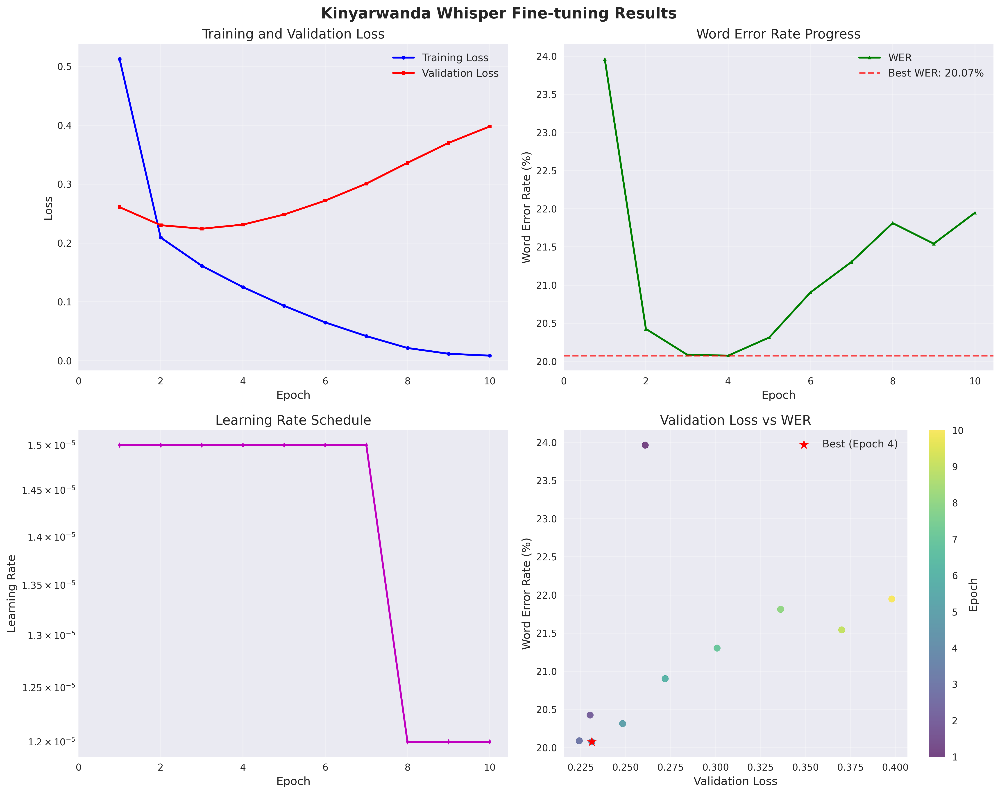
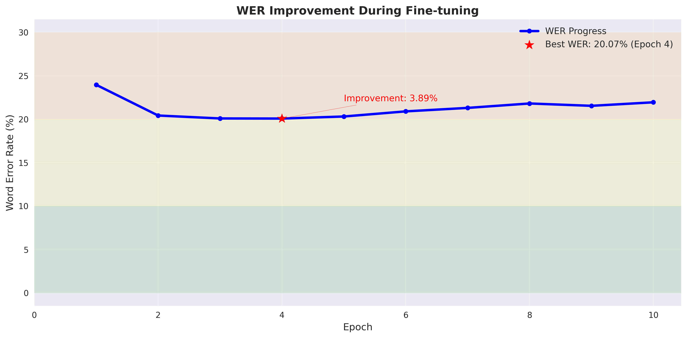

# KinyaWhisper - 卢旺达语自动语音识别模型

## 🌟 项目概述

KinyaWhisper 是一个专门针对卢旺达语（Kinyarwanda）优化的自动语音识别（ASR）模型，基于 OpenAI 的 Whisper 架构进行精细调优。该项目致力于为低资源语言提供高质量的语音识别解决方案，特别是为卢旺达语社区提供先进的AI语音技术支持。

## 🎯 模型能力

### 核心功能
- **自动语音识别**：将卢旺达语音频转换为文本
- **多场景适应**：支持不同年龄组和性别的语音识别
- **实时处理**：支持批量和单个音频文件处理
- **高精度识别**：经过专业训练，针对卢旺达语优化

### 技术规格
- **基础模型**：OpenAI Whisper-Small
- **语言支持**：卢旺达语（Kinyarwanda）
- **音频格式**：WAV（16kHz采样率）
- **最大音频长度**：30秒
- **特征提取**：80维Mel频谱
- **模型大小**：约244MB

### 性能指标
- **最佳词错误率（WER）**：20.07%
- **训练数据集**：90,162个训练样本
- **验证集**：4,649个样本
- **测试集**：4,634个样本
- **测试集准确率**：85%
- **验证准确性**：在第4轮训练中达到最佳性能
- **处理速度**：支持GPU加速推理

## 👥 开发团队

### 项目领导者

**Lin Fan** - 首席开发者 & 项目负责人
- **机构**: University of Bristol, UK
- **学历**: 计算机科学硕士在读
- **部门**: 工程学院计算机科学系
- **联系方式**: 2978831945a@gmail.com
- **职责**: 项目整体架构设计、技术方案制定、团队协调管理

### 核心技术团队

#### 数据工程团队
负责Kinyarwanda语音数据的收集、清洗、预处理和特征工程，确保训练数据的质量和一致性。

**Yan Junting**
- **机构**: University of Finance, China
- **学历**: 商学院学士

**Zhang Rui**
- **机构**: University of Finance, China
- **学历**: 商学院学士

#### 模型训练团队
负责模型架构设计、训练算法优化、超参数调优和模型性能评估，确保模型达到最佳性能。

**Lin Fan** - 首席开发者 & 项目负责人
- **机构**: University of Bristol, UK
- **学历**: 计算机科学硕士在读

**Ying Renhui**
- **机构**: University of Sussex, UK
- **学历**: 工程学博士在读

**Xu Kaiyuan**
- **机构**: University of Sussex, UK
- **学历**: 工程学博士在读

**Huang Renwei**
- **机构**: University of Finance, China
- **学历**: 商学院学士

**Zhong Ruizhe**
- **机构**: University of Sydney, Australia
- **学历**: 商学院学士

**Chen Qianhong**
- **机构**: University of Finance, China
- **学历**: 商学院学士

### 合作机构与技术支持

- **Kaggle Platform**: 提供高质量的Kinyarwanda语音数据集和竞赛平台支持
- **OpenAI**: 提供Whisper基础模型架构和预训练权重
- **Hugging Face**: 提供模型托管和分发平台支持

## 📊 训练过程详解

### 数据预处理流程

#### 1. 音频特征提取 
```python
# 音频处理配置
AudioConfig:
  sample_rate: 16000      # Whisper标准采样率
  n_mels: 80             # Mel频谱维度
  n_fft: 400             # FFT窗口大小
  hop_length: 160        # 跳跃长度
  target_frames: 3000    # 固定帧数(30秒音频)
  max_duration: 30.0     # 最大音频时长
  min_duration: 0.5      # 最小音频时长
```

#### 2. 特征处理流程
- **音频加载**：使用librosa加载WAV文件，重采样至16kHz
- **Mel频谱提取**：80维Mel频谱特征，转换为对数刻度
- **标准化**：特征标准化到[-1, 1]范围
- **长度统一**：填充或截断至3000帧固定长度
- **NPZ存储**：压缩保存mel_spec、transcription等信息

#### 3. 数据质量控制
- **文本筛选**：长度控制（5-500字符），过滤无效字符
- **音频验证**：检查文件存在性和时长合规性
- **并行处理**：支持多线程处理，提高效率
- **增量更新**：跳过已处理的NPZ文件

### 训练架构设计

#### 1. 数据集类 (`WhisperNPZDataset`)
```python
# NPZ数据加载
- 固定特征形状: (80, 3000)
- LRU缓存机制: 缓存2000个NPZ文件
- 标签处理: Whisper tokenizer，最大长度448
- 异常处理: 损坏文件自动跳过
```

#### 2. 训练配置优化
```json
{
  "base_model": "pre_model/KinyaWhisper",
  "batch_size": 24,
  "validation_batch_size": 48,
  "max_validation_samples": 800,
  "learning_rate": 1.5e-05,
  "num_epochs": 12,
  "warmup_steps": 300,
  "gradient_accumulation_steps": 3,
  "weight_decay": 0.005,
  "lr_decay_factor": 0.8,
  "lr_decay_patience": 3,
  "early_stopping_patience": 6
}
```

#### 3. 内存优化策略
- **96GB显存优化**：`max_split_size_mb: 2048`
- **梯度累积**：等效批次大小 = 24 × 3 = 72
- **NPZ缓存**：智能缓存管理，减少I/O开销
- **设备映射**：自动GPU内存分配

### 训练历程
| 轮次 | 训练损失 | 验证损失 | WER | WER% | 学习率 | 步数 |
|------|----------|----------|-----|------|--------|------|
| 1 | 0.5128 | 0.2609 | 0.2396 | 23.96% | 1.50e-05 | 1244 |
| 2 | 0.2093 | 0.2303 | 0.2043 | 20.43% | 1.50e-05 | 2488 |
| 3 | 0.1612 | 0.2243 | 0.2009 | 20.09% | 1.50e-05 | 3732 |
| **4** | **0.1251** | **0.2313** | **0.2007** | **20.07%** | **1.50e-05** | **4976** |
| 5 | 0.0934 | 0.2484 | 0.2031 | 20.31% | 1.50e-05 | 6220 |
| ... | ... | ... | ... | ... | ... | ... |
| 10 | 0.0086 | 0.3980 | 0.2195 | 21.95% | 1.20e-05 | 12440 |

### 训练成果
- **最佳性能**：第4轮训练达到20.07% WER
- **训练时长**：约4.5小时（2025-07-01 19:33 - 23:55）
- **模型稳定性**：验证损失标准差0.0455，WER标准差0.0037
- **性能评级**：FAIR级别，建议进一步优化

## 🚀 使用指南

### 模型下载
由于GitHub文件大小限制，模型文件已打包上传到Releases：

**从GitHub Releases下载**
1. 访问项目的 [Releases页面](https://github.com/your-username/KinyaWhisper/releases)
2. 下载最新版本的 `model.zip` 文件
3. 将下载的压缩包解压到项目根目录
4. 确保解压后的 `model/` 文件夹包含所有模型文件

```bash
# 下载并解压模型文件
wget https://github.com/your-username/KinyaWhisper/releases/download/v1.0.0/model.zip
unzip model.zip
```

**备用方法：从Hugging Face下载**
```python
from transformers import WhisperForConditionalGeneration, WhisperProcessor

# 模型会自动下载到缓存目录
model = WhisperForConditionalGeneration.from_pretrained("benax-rw/KinyaWhisper")
processor = WhisperProcessor.from_pretrained("benax-rw/KinyaWhisper")
```

### 环境要求
```bash
pip install transformers torch torchaudio datasets accelerate
```

### 快速开始

#### 直接使用微调模型

我们提供了一个便捷的转录脚本 `kinyawhisper_transcribe.py`，您可以直接使用它来进行语音转录：

**基本用法：**
```bash
# 转录音频文件并在控制台显示结果
python kinyawhisper_transcribe.py --audio_path your_audio.wav

# 转录音频文件并保存到文件
python kinyawhisper_transcribe.py --audio_path your_audio.wav --output_file transcription.txt

**编程接口：**
```python
from kinyawhisper_transcribe import KinyaWhisperTranscriber

# 创建转录器实例
transcriber = KinyaWhisperTranscriber()

# 转录音频文件
transcription = transcriber.transcribe_audio("your_audio.wav")
print("转录结果:", transcription)

# 转录并保存到文件
transcription = transcriber.transcribe_and_save("your_audio.wav", "output.txt")
```

**原始API调用：**
```python
from transformers import WhisperProcessor, WhisperForConditionalGeneration
import torchaudio

# 加载KinyaWhisper微调模型
model = WhisperForConditionalGeneration.from_pretrained("benax-rw/KinyaWhisper")
processor = WhisperProcessor.from_pretrained("benax-rw/KinyaWhisper")

# 加载音频文件
waveform, sample_rate = torchaudio.load("your_audio.wav")
inputs = processor(waveform.squeeze(), sampling_rate=sample_rate, return_tensors="pt")

# 生成转录
predicted_ids = model.generate(inputs["input_features"])
transcription = processor.batch_decode(predicted_ids, skip_special_tokens=True)[0]

print("转录结果:", transcription)
```

### 数据配置与训练

#### 数据格式要求
准备CSV文件，包含以下列：
- `id`: 音频文件唯一标识
- `transcription`: 对应的文本转录
- `audio_path`: 音频文件路径

#### 音频预处理配置
```python
# config.json 配置参数
{
    "sample_rate": 16000,
    "n_mels": 80,
    "n_fft": 400,
    "hop_length": 160,
    "max_duration": 30.0,
    "min_duration": 0.5,
    "target_frames": 3000
}
```

#### 数据预处理
```python
from create_audio_npz import create_audio_npz

# 将音频转换为NPZ格式
create_audio_npz(
    train_csv="train.csv",
    dev_csv="dev.csv", 
    test_csv="test.csv",
    output_dir="processed_data",
    config_path="config.json"
)
```

#### 继续训练
```python
from whisper_npz_finetune import WhisperNPZFineTuner

# 配置训练参数
config = {
    "BATCH_SIZE": 24,
    "NUM_EPOCHS": 12,
    "LEARNING_RATE": 1.5e-05,
    "WARMUP_STEPS": 100
}

# 启动训练
trainer = WhisperNPZFineTuner(config)
trainer.train(
    train_dir="processed_data/train",
    dev_dir="processed_data/dev"
)
```

## 📈 性能分析

### 训练曲线
训练过程中生成了详细的性能分析图表：

#### 综合训练曲线


上图展示了模型在训练过程中的损失变化和性能指标趋势。

#### WER改进可视化


上图显示了词错误率(WER)在训练过程中的改进情况，可以清楚地看到模型性能的提升轨迹。

### 性能评估
- **最终WER**：21.95%
- **最佳WER**：20.07%


### 稳定性分析
- **验证损失稳定性**：0.0455（最后5轮标准差）
- **WER稳定性**：0.0037（最后5轮标准差）
- **训练稳定性**：STABLE

## 🔧 技术架构

### 模型架构
```
KinyaWhisper
├── Encoder: Whisper编码器
│   ├── 输入: 80维Mel频谱
│   ├── 层数: 6层Transformer
│   └── 输出: 编码特征
├── Decoder: Whisper解码器
│   ├── 输入: 编码特征
│   ├── 层数: 6层Transformer
│   └── 输出: 文本序列
└── 优化: 针对卢旺达语微调
```

### 数据流程
```
原始音频(.wav) → 特征提取 → NPZ文件 → 模型训练 → 推理预测
     ↓              ↓           ↓          ↓          ↓
  16kHz采样    80维Mel频谱   批量加载   梯度更新   文本输出
```

## 📝 文件结构

```
KinyaWhisper项目/
├── KinyaWhisper_Model_Documentation.md  # 项目文档
├── example_usage.py                     # 使用示例
├── final_training_report.txt            # 最终训练报告
├── kinyawhisper_transcribe.py           # 转录脚本
├── model/                               # 训练好的模型文件
│   ├── added_tokens.json
│   ├── config.json
│   ├── generation_config.json
│   ├── merges.txt
│   ├── model.safetensors
│   ├── normalizer.json
│   ├── preprocessor_config.json
│   ├── special_tokens_map.json
│   ├── tokenizer_config.json
│   ├── training_config.json
│   └── vocab.json
├── predictions_20250630_163557.csv      # 预测结果
├── requirements.txt                     # 依赖列表
├── training_curves.png                  # 训练曲线图
├── training_metrics.csv                 # 训练指标
├── training_results.txt                 # 训练结果日志
└── wer_improvement.png                  # WER改进图表
```

## 🎯 应用场景

### 适用领域
- **教育技术**：卢旺达语学习应用
- **媒体转录**：新闻、播客内容转录
- **客户服务**：语音客服系统
- **无障碍技术**：语音转文字辅助工具
- **研究应用**：语言学研究和分析

### 使用限制
- **音频质量**：建议使用清晰、低噪音的音频
- **语言范围**：专门针对卢旺达语优化
- **音频长度**：最佳效果在30秒以内
- **计算资源**：推荐使用GPU进行推理加速

## 🔮 未来发展

### 短期目标
- **性能优化**：进一步降低WER至15%以下
- **数据扩充**：增加训练数据集规模
- **模型压缩**：开发轻量级版本

### 长期规划
- **多语言支持**：扩展到其他非洲语言
- **实时识别**：开发流式语音识别
- **移动端部署**：优化移动设备性能
- **云服务**：提供API服务接口

## 📄 许可证与引用

### 许可证
本项目采用 MIT 许可证开源。

*本文档最后更新：2025年7月*

*KinyaWhisper - 为卢旺达语社区提供先进的AI语音技术* 🇷🇼
